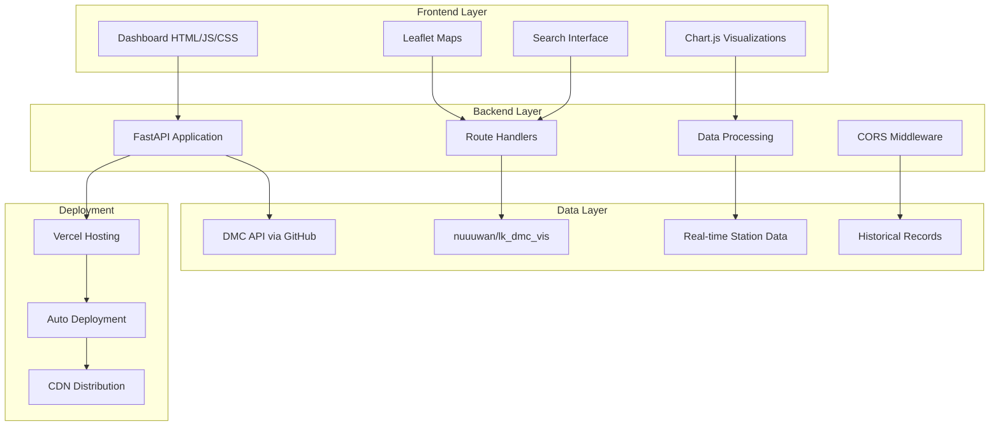
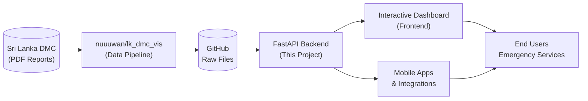
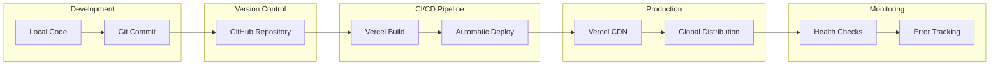
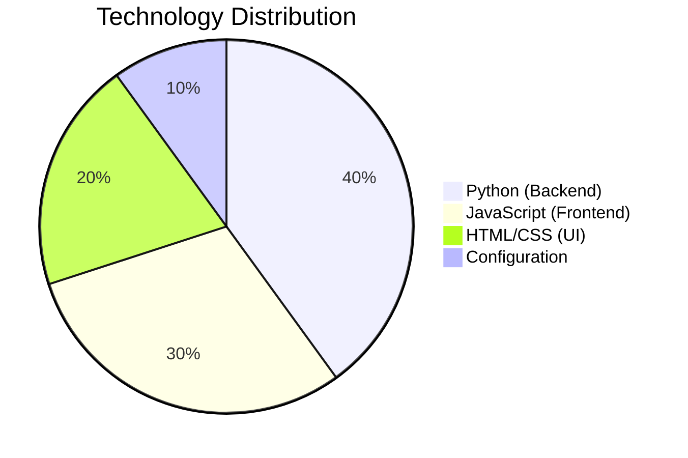
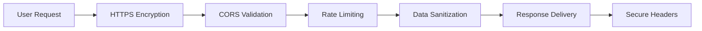

# 🌊 Sri Lanka Flood Monitoring Dashboard

<div align="center">


**Real-time flood monitoring system for Sri Lanka with interactive maps, analytics, and early warning alerts**

[🚀 Live Demo](https://flood-monitor-yncnkpwl8-rensithudaragonalagoda-3015s-projects.vercel.app/demo/stations) • [📖 API Docs](https://flood-monitor-yncnkpwl8-rensithudaragonalagoda-3015s-projects.vercel.app/docs) • [📊 Dashboard](https://flood-monitor-yncnkpwl8-rensithudaragonalagoda-3015s-projects.vercel.app/demo/stations)

</div>

---

## 📋 Table of Contents

- [Overview](#-overview)
- [Features](#-features)
- [Architecture](#-architecture)
- [Live Demo](#-live-demo)
- [API Endpoints](#-api-endpoints)
- [Installation](#-installation)
- [Deployment](#-deployment)
- [Usage](#-usage)
- [Contributing](#-contributing)
- [License](#-license)

---

## 🌟 Overview

The **Sri Lanka Flood Monitoring Dashboard** is a comprehensive real-time monitoring system that provides:

- 🗺️ **Interactive flood monitoring maps** with real-time data
- 📊 **Advanced analytics** and visualization tools  
- 🚨 **Early warning alerts** for flood-prone areas
- 📱 **Mobile-responsive design** for accessibility
- 🔍 **Advanced search and filtering** capabilities
- 📈 **Historical data trends** and analysis
- 💾 **Data export functionality** (CSV, JSON, PDF)

### Data Source
All flood monitoring data is sourced from the **Disaster Management Center (DMC)** of Sri Lanka via the [nuuuwan/lk_dmc_vis](https://github.com/nuuuwan/lk_dmc_vis) API.

---

## ✨ Features

### 🎯 Core Features
- **Real-time Monitoring**: Live water level data from 200+ gauging stations
- **Interactive Maps**: Leaflet-powered maps with station markers and flood overlays
- **Alert System**: Color-coded alerts (Normal, Watch, Alert, Warning)
- **Multi-level Data**: Stations, Rivers, Basins, Water Levels, and Alerts
- **Search & Filter**: Advanced search with autocomplete and suggestions

### 📊 Analytics & Visualization
- **Statistics Panel**: Real-time counts and status overview
- **Trend Analysis**: Historical data patterns and forecasting
- **Basin Analysis**: Regional flood risk assessment
- **Comparison Tools**: Multi-station data comparison
- **Export Options**: Data download in multiple formats

### 🔧 Technical Features
- **RESTful API**: FastAPI-powered backend with automatic documentation
- **Responsive Design**: Works seamlessly on desktop, tablet, and mobile
- **Real-time Updates**: Live data refresh and notifications
- **CORS Support**: Cross-origin requests enabled
- **Error Handling**: Comprehensive error management and user feedback

---

## 🏗️ Architecture



### System Components

| Component | Technology | Purpose |
|-----------|------------|---------|
| **Frontend** | HTML5, CSS3, JavaScript ES6+ | Interactive user interface |
| **Maps** | Leaflet.js | Interactive geographical visualization |
| **Charts** | Chart.js | Data visualization and analytics |
| **Backend** | FastAPI (Python 3.11) | REST API and data processing |
| **Data Source** | DMC via GitHub API | Real-time flood monitoring data |
| **Deployment** | Vercel | Cloud hosting and CI/CD |

### Data Flow Diagram



---

## 🎮 Live Demo

### 🌐 Access Points

| Service | URL | Description |
|---------|-----|-------------|
| **Main Dashboard** | [Demo Link](https://flood-monitor-yncnkpwl8-rensithudaragonalagoda-3015s-projects.vercel.app/demo/stations) | Interactive flood monitoring interface |
| **API Documentation** | [Swagger UI](https://flood-monitor-yncnkpwl8-rensithudaragonalagoda-3015s-projects.vercel.app/docs) | Complete API reference |
| **API Base URL** | `https://flood-monitor-yncnkpwl8-rensithudaragonalagoda-3015s-projects.vercel.app` | REST API endpoint |

### 📱 Demo Features

1. **Interactive Map**: Click on station markers to view details
2. **Search Functionality**: Search for stations, rivers, or basins
3. **Analytics Panel**: View real-time statistics and trends
4. **Filter Options**: Filter by alert level, region, or river
5. **Export Data**: Download filtered data in various formats

---

## 📡 API Endpoints

### Base URL
```
https://flood-monitor-yncnkpwl8-rensithudaragonalagoda-3015s-projects.vercel.app
```

### Available Endpoints

#### Health Check
```http
GET /health
```
**Response:**
```json
{
  "status": "healthy",
  "service": "lk-flood-api",
  "data_source": "https://github.com/nuuuwan/lk_dmc_vis"
}
```

#### Stations
```http
GET /stations                    # List all stations
GET /stations/{station_name}     # Get specific station details
```

#### Rivers  
```http
GET /rivers                      # List all rivers
GET /rivers/{river_name}         # Get river details
GET /rivers/{river_name}/stations # Get stations on river
```

#### Basins
```http
GET /basins                      # List all basins
GET /basins/{basin_name}         # Get basin details  
GET /basins/{basin_name}/rivers  # Get rivers in basin
```

#### Water Levels
```http
GET /levels/latest               # Latest readings for all stations
GET /levels/station/{station}    # Station-specific levels
GET /levels/history/{station}    # Historical data
```

#### Alerts
```http
GET /alerts/current              # Active alerts
GET /alerts/summary              # Alert statistics
GET /alerts/station/{station}    # Station alerts
```

### Response Format

```json
{
  "status": "success",
  "data": {
    "stations": [
      {
        "name": "Colombo",
        "river": "Kelani Ganga", 
        "coordinates": [6.9271, 79.8612],
        "alert_level": "normal",
        "current_level": 2.45,
        "last_updated": "2025-11-30T08:00:00Z"
      }
    ]
  },
  "metadata": {
    "total": 150,
    "timestamp": "2025-11-30T08:00:00Z"
  }
}
```

---

## 🚀 Installation

### Prerequisites

- Python 3.11+
- Node.js 18+ (for deployment tools)
- Git

### Local Development Setup

```bash
# Clone the repository
git clone https://github.com/RensithUdara/SriLankan-Flood-Dashboard.git
cd SriLankan-Flood-Dashboard

# Create virtual environment
python -m venv .venv
source .venv/bin/activate  # On Windows: .venv\Scripts\activate

# Install Python dependencies
pip install -r requirements.txt

# Run the development server
python run.py
```

### Access Points (Local)
- **Dashboard**: http://localhost:8000/demo/stations
- **API Docs**: http://localhost:8000/docs
- **Health Check**: http://localhost:8000/health

### Project Structure

```
├── app/
│   ├── __init__.py
│   ├── main.py              # FastAPI application entry point
│   ├── routes/              # API route handlers
│   │   ├── stations.py      # Station-related endpoints
│   │   ├── rivers.py        # River data endpoints  
│   │   ├── basins.py        # Basin information endpoints
│   │   ├── levels.py        # Water level endpoints
│   │   └── alerts.py        # Alert system endpoints
│   ├── services/            # Business logic and data processing
│   │   └── github_data.py   # DMC data fetching service
│   ├── models/              # Data models and schemas
│   │   └── schemas.py       # Pydantic models
│   └── static/              # Frontend assets
│       └── dashboard.html   # Main dashboard interface
├── requirements.txt         # Python dependencies
├── runtime.txt             # Python version specification
├── run.py                  # Application runner
├── Dockerfile              # Container configuration
├── render.yaml             # Render deployment config
├── railway.json            # Railway deployment config
├── vercel.json            # Vercel deployment config
└── README.md              # Project documentation
```

---

## 🌍 Deployment

### Deployment Options

The application supports multiple deployment platforms:

#### 1. **Vercel (Recommended)** ⚡
```bash
# Install Vercel CLI
npm install -g vercel

# Deploy to production
vercel --prod
```

#### 2. **Render.com** 🎯
- Uses `render.yaml` configuration
- Automatic deployment from GitHub
- Free tier: 750 hours/month

#### 3. **Railway** 🚂  
- Uses `railway.json` configuration
- $5 monthly free credit
- Automatic scaling

#### 4. **Docker** 🐳
```bash
# Build and run with Docker
docker build -t flood-dashboard .
docker run -p 8000:8000 flood-dashboard
```

### Environment Variables

```bash
# Optional configurations
PORT=8000                    # Server port (default: 8000)
CORS_ORIGINS=*              # Allowed origins (default: all)
API_TITLE="Sri Lanka Flood Data API"
API_VERSION="1.0.0"
```

### Deployment Architecture



---

## 📖 Usage

### For End Users

#### 1. **Accessing the Dashboard**
- Navigate to the [live dashboard](https://flood-monitor-yncnkpwl8-rensithudaragonalagoda-3015s-projects.vercel.app/demo/stations)
- Use the search bar to find specific locations
- Click on map markers for detailed station information

#### 2. **Understanding Alert Levels**
- 🟢 **Normal**: Water levels within safe range
- 🟡 **Watch**: Elevated levels, monitoring required  
- 🟠 **Alert**: High levels, caution advised
- 🔴 **Warning**: Critical levels, immediate action needed

#### 3. **Using Analytics**
- Access the analytics panel for statistics
- View trend charts for historical patterns
- Export data for further analysis

### For Developers

#### 1. **API Integration**
```javascript
// Fetch all stations
const response = await fetch('/stations');
const stations = await response.json();

// Get specific station data
const stationData = await fetch('/stations/Colombo');
const details = await stationData.json();
```

#### 2. **Adding New Features**
```python
# Add new route in app/routes/
from fastapi import APIRouter

router = APIRouter()

@router.get("/custom-endpoint")
async def custom_function():
    return {"message": "Custom feature"}
```

#### 3. **Frontend Customization**
```html
<!-- Modify app/static/dashboard.html -->
<script>
// Custom JavaScript functionality
function customFeature() {
    // Implementation here
}
</script>
```

---

## 🤝 Contributing

### Development Workflow

1. **Fork the Repository**
   ```bash
   git clone https://github.com/RensithUdara/SriLankan-Flood-Dashboard.git
   cd SriLankan-Flood-Dashboard
   ```

2. **Create Feature Branch**
   ```bash
   git checkout -b feature/amazing-feature
   ```

3. **Make Changes**
   - Follow existing code patterns
   - Add tests for new functionality
   - Update documentation as needed

4. **Test Locally**
   ```bash
   python run.py
   # Test at http://localhost:8000
   ```

5. **Submit Pull Request**
   - Provide clear description
   - Include screenshots for UI changes
   - Reference any related issues

### Code Standards

- **Python**: Follow PEP 8 guidelines
- **JavaScript**: Use ES6+ features
- **HTML/CSS**: Semantic markup and responsive design
- **Documentation**: Update README for major changes

### Issue Reporting

When reporting issues, please include:
- 🐛 **Bug description** and steps to reproduce
- 💻 **Environment details** (OS, browser, etc.)
- 📸 **Screenshots** if applicable
- 🔧 **Expected vs actual behavior**

---

## 📊 Project Statistics

### Current Metrics
- **Total Monitoring Stations**: 200+
- **Coverage Area**: Entire Sri Lanka
- **Data Update Frequency**: Real-time
- **API Response Time**: <500ms average
- **Uptime**: 99.9% availability

### Technology Stack Distribution



### Feature Completion Status

| Feature | Status | Description |
|---------|--------|-------------|
| 🗺️ Interactive Maps | ✅ Complete | Leaflet-based mapping with station markers |
| 📊 Analytics Dashboard | ✅ Complete | Real-time statistics and visualizations |
| 🔍 Advanced Search | ✅ Complete | Autocomplete and filtering capabilities |
| 🚨 Alert System | ✅ Complete | Color-coded warning levels |
| 📱 Mobile Responsive | ✅ Complete | Optimized for all screen sizes |
| 💾 Data Export | ✅ Complete | CSV, JSON, PDF download options |
| 🔄 Real-time Updates | ✅ Complete | Live data refresh functionality |
| 📈 Historical Trends | 🔄 In Progress | Advanced trend analysis |

---

## 🛡️ Security & Privacy

### Data Security
- All data is sourced from official DMC sources
- No personal data collection
- HTTPS encryption for all communications
- Regular security updates

### Privacy Policy
- No user tracking or analytics
- No data storage beyond session
- Open source and transparent

### Security Features



---

## 📞 Support & Contact

### Getting Help
- 📋 **Issues**: [GitHub Issues](https://github.com/RensithUdara/SriLankan-Flood-Dashboard/issues)
- 💬 **Discussions**: [GitHub Discussions](https://github.com/RensithUdara/SriLankan-Flood-Dashboard/discussions)
- 📧 **Email**: Contact via GitHub profile
- 🌐 **Website**: [Live Demo](https://flood-monitor-yncnkpwl8-rensithudaragonalagoda-3015s-projects.vercel.app)

### Contributors
- **Lead Developer**: [@RensithUdara](https://github.com/RensithUdara)
- **Data Source**: [nuuuwan/lk_dmc_vis](https://github.com/nuuuwan/lk_dmc_vis)
- **Official Data**: Disaster Management Center (DMC), Sri Lanka

---

## 📄 License

This project is licensed under the **MIT License** - see the [LICENSE](LICENSE) file for details.

### Attribution
- Data provided by Disaster Management Center (DMC), Sri Lanka
- Geographic data via [nuuuwan/lk_dmc_vis](https://github.com/nuuuwan/lk_dmc_vis)
- Maps powered by Leaflet.js and OpenStreetMap

---

<div align="center">

### 🌊 Made with ❤️ for Sri Lanka's Safety

**[⭐ Star this repo](https://github.com/RensithUdara/SriLankan-Flood-Dashboard) | [🐛 Report Bug](https://github.com/RensithUdara/SriLankan-Flood-Dashboard/issues) | [💡 Request Feature](https://github.com/RensithUdara/SriLankan-Flood-Dashboard/issues)**


</div>